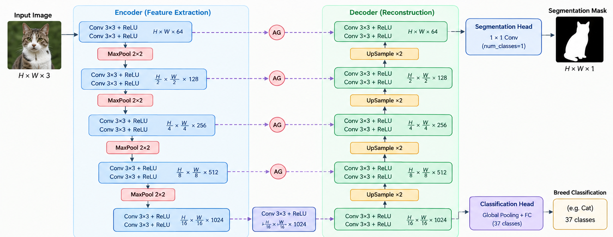

# Multi-Task Pet Segmentation & Breed Classification

**Base U-Net vs. Attention U-Net on the Oxford-IIIT Pet dataset (PyTorch)**

[](https://colab.research.google.com/github/YOUR-USERNAME/cse428/blob/main/CSE428_Oxford_Pet_MultiTask_Unet_64.ipynb)


Course project for **CSE 428: Computer Vision & Pattern Recognition**.

From a **single pet photograph**, one network answers two questions at once:

1. **Where is the pet?** Pixel-wise binary semantic segmentation (pet vs. background).
2. **What breed is it?** 37-class fine-grained breed classification.

A shared U-Net encoder learns features for both tasks. The decoder produces the segmentation mask, and a classification head attached to the bottleneck predicts the breed. Two architectures are implemented and compared: a **Base U-Net** and an **Attention U-Net**.



---

## Table of Contents

- [Overview](#overview)
- [Dataset](#dataset)
- [Method](#method)
- [Training Setup](#training-setup)
- [Results](#results)
- [Repository Structure](#repository-structure)
- [Getting Started](#getting-started)
- [Reproducibility](#reproducibility)
- [References](#references)
- [Author](#author)

---

## Overview

| Item | Details |
|---|---|
| Tasks | Binary pet segmentation and 37-breed classification |
| Models | Base U-Net, Attention U-Net (both with a bottleneck classification head) |
| Framework | PyTorch (mixed precision when CUDA is available) |
| Parameters | Base U-Net: 7,904,390 · Attention U-Net: 7,993,122 |
| Input size | 256 × 256 |
| Metrics | mIoU, Dice, pixel accuracy, classification accuracy, macro precision / recall / F1 |

---

## Dataset

**[Oxford-IIIT Pet Dataset](https://www.robots.ox.ac.uk/~vgg/data/pets/)** — 37 breeds (25 dogs, 12 cats), with breed labels and trimap segmentation masks.

**Mask preprocessing.** The original trimap has three values (1 = pet, 2 = background, 3 = boundary/unclassified). For the binary task, pet and boundary pixels are merged into foreground:

```
binary_mask = 1  if pixel in {1, 3}   (pet)
              0  if pixel == 2        (background)
```

**Splits** (official `trainval` / `test` lists, with 10 % of `trainval` held out for validation, seed 42):

| Split | Images |
|---|---|
| Train | 3,312 |
| Validation | 368 |
| Test | 3,669 |

**Preprocessing and augmentation**

- Images and masks resized to 256 × 256 (bilinear for images, nearest-neighbor for masks so labels stay discrete).
- ImageNet channel normalization (mean `[0.485, 0.456, 0.406]`, std `[0.229, 0.224, 0.225]`).
- Training-time augmentation: horizontal flip, small rotations (±15°), brightness and contrast jitter. Geometric transforms are applied identically to image and mask so they stay aligned.

The notebook includes a 3×3 grid of random image/mask overlays to verify mask conversion and alignment before training.

---

## Method

### Base U-Net
- **Encoder:** 4 downsampling stages of double convolutions (Conv3×3 → BatchNorm → ReLU) with max pooling.
- **Bottleneck:** shared, compact high-level representation used by both tasks.
- **Decoder:** 4 upsampling stages (transposed convolutions) with direct skip-connection concatenation.
- **Classification head:** attached to the bottleneck — adaptive average pooling, BatchNorm, ReLU, Dropout (p = 0.35), and two linear layers producing 37 logits.

### Attention U-Net
Same as above, but each skip connection passes through an **additive attention gate** before concatenation. The decoder gating signal `g` and the encoder skip feature `x` are combined to produce spatial attention weights:

```
alpha = sigmoid( psi^T * ReLU( W_g * g + W_x * x + b ) )
x_hat = alpha * x
```

### Multi-task loss

```
L_total = L_BCE + L_Dice + 0.35 * L_CE
```

- **BCE (with logits)** supervises each pixel as pet or background.
- **Dice loss** directly optimizes region overlap.
- **Cross-entropy** supervises the 37-way breed prediction, weighted by 0.35 to balance it against segmentation.

---

## Training Setup

| Hyperparameter | Value |
|---|---|
| Epochs | 30 |
| Batch size | 16 |
| Base feature channels | 64 |
| Optimizer | AdamW |
| Learning rate | 7e-4 (cosine annealing to 1e-5) |
| Weight decay | 1e-4 |
| Classifier dropout | 0.35 |
| Classification loss weight | 0.35 |
| Segmentation threshold | 0.5 |
| Gradient clipping | L₂ norm ≤ 1.0 |
| Mixed precision (AMP) | Enabled on CUDA |
| Random seed | 42 |

The checkpoint with the best **validation mIoU** is saved and used for final evaluation.

---

## Results

Metrics are computed by evaluating the saved best checkpoints on each split. Classification precision, recall, and F1 use macro averaging so all 37 breeds count equally.

| Model | Split | mIoU | Macro Precision | Macro Recall | Macro F1 |
|---|---|---|---|---|---|
| Base U-Net | Train | 0.8698 | 0.8611 | 0.8591 | 0.8577 |
| Base U-Net | Validation | 0.8564 | 0.6469 | 0.6394 | 0.6315 |
| Base U-Net | **Test** | **0.8567** | **0.5897** | **0.5839** | **0.5782** |
| Attention U-Net | Train | 0.8618 | 0.8000 | 0.7970 | 0.7949 |
| Attention U-Net | Validation | 0.8495 | 0.5909 | 0.5856 | 0.5746 |
| Attention U-Net | **Test** | **0.8479** | **0.5410** | **0.5381** | **0.5338** |

**Test-set difference (Attention U-Net − Base U-Net):**

| Metric | Difference |
|---|---|
| mIoU | −0.0089 |
| Dice | −0.0060 |
| Pixel accuracy | −0.0037 |
| Breed accuracy | −0.0461 |
| Macro precision | −0.0487 |
| Macro recall | −0.0458 |
| Macro F1 | −0.0443 |

The full table (including Dice, pixel accuracy, and breed accuracy for every split) is saved by the notebook to `results/final_model_comparison.csv`.

### Observations

- **Segmentation is strong for both models** (test mIoU ≈ 0.85), and the two are close.
- **In this experiment, Attention U-Net did not outperform the Base U-Net** on any test metric. Adding attention gates does not guarantee improvement — results depend on data size, model capacity, and training budget.
- **Breed classification is much harder than segmentation.** Fine-grained breeds look alike; separating pet from background requires far less discrimination than naming its breed.
- **A clear train/test gap on classification** (Base U-Net macro F1 ≈ 0.86 on train vs. ≈ 0.58 on test) points to overfitting in the classification head, despite dropout and weight decay.

<!-- Add training curves and the metric bar chart here, e.g.:


-->

---

## Repository Structure

```
cse428/
├── CSE428_Oxford_Pet_MultiTask_Unet_64.ipynb   # Full pipeline: data, models, training, evaluation, demo
├── README.md
├── pipline.png                                  # Architecture pipeline diagram
├── checkpoints/                                 # Saved model weights (auto-created at runtime)
│   ├── best_unet.pth
│   └── best_attention_unet.pth
└── results/                                     # Metrics CSV, training curves, figures (auto-created)
    ├── final_model_comparison.csv
    ├── base_unet_training_statistics.png
    ├── attention_unet_training_statistics.png
    └── comparative_training_statistics.png
```

The notebook is organized in 13 named sections: hardware setup, configuration, dataset ingestion, mask preprocessing & augmentation, 3×3 exploration grid, model architectures, multi-task loss, training of Base U-Net, training of Attention U-Net, training curves, quantitative evaluation, visual demonstration, and conclusion.

> **Paths are resolved dynamically.** On Kaggle outputs go to `/kaggle/working/`, on Colab to `/content/`, and on a local machine to the notebook's working directory.

---

## Getting Started

### 1. Clone the repository

```bash
git clone https://github.com/YOUR-USERNAME/cse428.git
cd cse428
```

### 2. Install dependencies

```bash
pip install torch torchvision numpy pandas pillow tqdm matplotlib scikit-learn jupyter
```

A GPU is strongly recommended for training. The notebook falls back to CPU automatically.

### 3. Get the dataset

Download **images** and **annotations** from the [official Oxford-IIIT Pet page](https://www.robots.ox.ac.uk/~vgg/data/pets/) and extract them into a `data/` folder:

```
data/
├── images/           # *.jpg
└── annotations/
    ├── trimaps/      # *.png
    ├── list.txt
    ├── trainval.txt
    └── test.txt
```

The notebook auto-discovers the dataset in common locations (including Kaggle's `/kaggle/input` and Colab's `/content`). No manual path configuration is needed.

### 4. Run

```bash
jupyter notebook CSE428_Oxford_Pet_MultiTask_Unet_64.ipynb
```

Run all cells in order. The notebook runs on **Kaggle**, **Google Colab**, or a **local machine** (including Windows — data-loader workers are set to 0 automatically). Set `RETRAIN = True` in the training cells to train from scratch, or leave it as `False` to load saved checkpoints instantly.

### Live demo

The final section (Cell 25) takes any test-image index, runs the model, and shows a three-panel output: the original image, the image with the true mask overlaid, and the image with the predicted mask overlaid — along with the predicted breed and per-image IoU.

```python
# By index
display_guideline_prediction(sample_idx=0, model_type="attention_unet")

# Random test sample
display_guideline_prediction(entry=random.choice(test_entries), model_type="attention_unet")

# Custom image
display_guideline_prediction(custom_img_path="path/to/my_pet.jpg", model_type="base_unet")
```

---

## Reproducibility

Random seeds are fixed to 42 across Python, NumPy, and PyTorch at startup. Note that GPU non-determinism and mixed precision can still introduce small run-to-run differences.

---

## References

- O. Ronneberger, P. Fischer, T. Brox. *U-Net: Convolutional Networks for Biomedical Image Segmentation*. MICCAI, 2015. [arXiv:1505.04597](https://arxiv.org/abs/1505.04597)
- O. Oktay et al. *Attention U-Net: Learning Where to Look for the Pancreas*. MIDL, 2018. [arXiv:1804.03999](https://arxiv.org/abs/1804.03999)
- O. M. Parkhi, A. Vedaldi, A. Zisserman, C. V. Jawahar. *Cats and Dogs*. CVPR, 2012. [Dataset](https://www.robots.ox.ac.uk/~vgg/data/pets/)

---

## Author

**Mehreen Mallick Fiona** · CSE 428 · BRAC University

**Tareq Sujat** · CSE 428 · BRAC University

[LinkedIn](https://www.linkedin.com/in/mehreen-mallick-fiona/) · [GitHub](https://github.com/YOUR-USERNAME)
